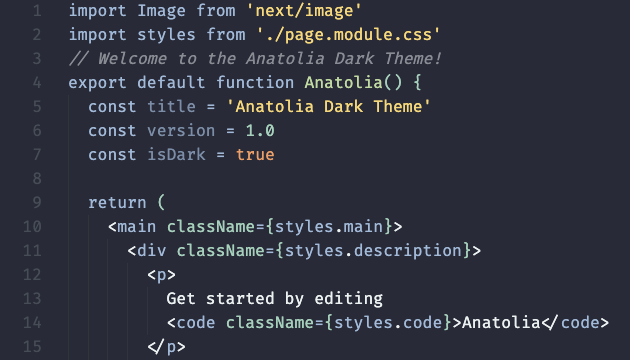

### Anatolia Dark Theme

"Anatolia Dark Theme" is an elegant and visually pleasing dark theme inspired by the rich culture and history of Anatolia. With its harmonious color palette and subtle accents, this theme provides a comfortable and immersive coding experience. The carefully selected colors ensure excellent readability and focus, making your code stand out against the dark backdrop. Embrace the essence of Anatolia's beauty while you code with the "Anatolia Dark Theme" for Visual Studio Code.

#### Key Features
- Distinctive color scheme inspired by Anatolian heritage
- Excellent code readability for prolonged coding sessions
- Subtle accents and gentle contrasts for a relaxing experience
- Suitable for a wide range of programming languages and file types

Join us on this journey through Anatolia's mystique with our dark-themed coding environment. Enhance your coding productivity and enjoy the aesthetic appeal of "Anatolia Dark Theme" in your Visual Studio Code editor.

Give it a try and experience the magic of Anatolia while you code!
